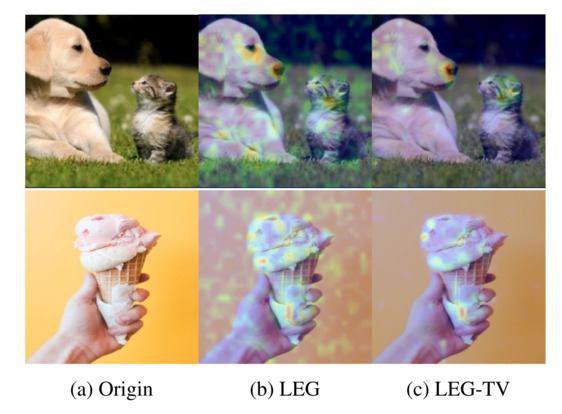
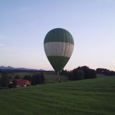

<!-- ## Getting started -->

<!-- {: .no_toc }

## Table of contents
{: .no_toc .text-delta }

1. TOC
{:toc} -->


# LEG (Linearly Estimated Gradient)
{: .fs-9 }

LEG gives you a visual interpretation of what is happening under the hood of deep learning models.
{: .fs-6 .fw-300 }

<!-- [Get started now](#getting-started){: .btn .btn-primary .fs-5 .mb-4 .mb-md-0 .mr-2 }  -->
[View it on GitHub](https://github.com/Paradise1008/LEG)
[Try it on Google Colab](https://colab.research.google.com/drive/1CcFfpcG7N0UNqcld7cYB5Y45hOpTipPG#scrollTo=ykkrWKKr9G3w)
{: .btn .fs-5 .mb-4 .mb-md-0 }

---


## A Visual Example



---

<!-- # Examples

This section provides explained examples with LEG explainer: -->
<!-- * Computer Vision -->
<!-- * NLP -->

## CV Examples

In these CV examples we will give the input original image and the [saliency map](https://en.wikipedia.org/wiki/Saliency_map#:~:text=In%20computer%20vision%2C%20a%20saliency,to%20the%20human%20visual%20system.) interpreted from LEG and LEG-TV.


## VGG16

### [](#header-1)Results for [VGG16](https://arxiv.org/abs/1409.1556) with ***LEG***:

| description |                input               |                   ***LEG*** output                |
|:------------|:-----------------------------------|:--------------------------------------------------|
| balloon     |  |   |
| bear        |     |      |
| soccer      |   |    |


### [](#header-2)Results for [VGG16](https://arxiv.org/abs/1409.1556) with ***LEGTV***

| description |                input               |                   ***LEGTV*** output                  |
|:------------|:-----------------------------------|:------------------------------------------------------|
| balloon     |  |   |
| bear        |     |      |
| soccer      |   |    |

## VGG19

### [](#header-1)Results for [VGG19](https://arxiv.org/abs/1409.1556) with ***LEG***:

| description |                input               |                   ***LEG*** output                |
|:------------|:-----------------------------------|:--------------------------------------------------|
| balloon     |  |   |
| bear        |     |      |
| soccer      |   |    |


### [](#header-2)Results for [VGG19](https://arxiv.org/abs/1409.1556) with ***LEGTV***

| description |                input               |                   ***LEGTV*** output                  |
|:------------|:-----------------------------------|:------------------------------------------------------|
| balloon     |  |   |
| bear        |     |      |
| soccer      |   |    |

## ResNet50

### [](#header-1)Results for [ResNet50](https://arxiv.org/abs/1512.03385) with ***LEG***:

| description |                input               |                   ***LEG*** output                |
|:------------|:-----------------------------------|:--------------------------------------------------|
| balloon     |  |   |
| bear        |     |      |
| soccer      |   |    |


### [](#header-2)Results for [ResNet50](https://arxiv.org/abs/1512.03385) with ***LEGTV***

| description |                input               |                   ***LEGTV*** output                  |
|:------------|:-----------------------------------|:------------------------------------------------------|
| balloon     |  |   |
| bear        |     |      |
| soccer      |   |  


### What is LEG explainer?

LEG is a statistical framework for saliency estimation for black-box computer vision
models. You can find the paper [here](https://openaccess.thecvf.com/content/ICCV2021/papers/Luo_Statistically_Consistent_Saliency_Estimation_ICCV_2021_paper.pdf)

There is also a new computationally efficient estimator (LEG-TV) proposed using graphical
representations of data.


# Quick Start


Before you begin, please read the [installation guide]({{ site.baseurl }}/docs/Installation) and have all required dependencies properly installed.


---


### Dependencies

* [cvxpy](https://github.com/cvxgrp/cvxpy) 
* [Mosek](https://www.mosek.com/documentation/)
* [tensorflow/keras](https://www.tensorflow.org/)
* [matplotlib](https://matplotlib.org/users/installing.html)
* [skimage](https://github.com/scikit-image/scikit-image)

## Main Structure

* `methods/LEGv0.py`: Implementation of LEG explainer.
* `ImageNetExp.py`: Create the 500 LEG and LEG-TV explanations on ImageNet.
* `Sanity/`: folder including implementations of cascading randomizations on LeNet-5 in MNIST and VGG-19 in ImageNet dataset.
* `Plots/ :` Implementations of plots in papers including sensitivity analysis.
* `table/keysizetable.py`:Implementation of computing key size for each saliency method.


## Usage

The `LEG_explainer` function is called with the following basic inputs:
```python
 LEG_explainer(inputs, model, predict_func, penalty, noise_lvl, lambda_arr, num_sample):
```
The function returns lists for all inputs. Each list contains the saliency map, original image, prediction of original image and corresponding lambda level for saliency map in turn. 

We also provide a customized function for visualization:
```python
generateHeatmap(image, heatmap, name, style, show_option, direction):
```
You can choose the "heatmap_only", "gray" or "overlay" style for the heatmap and decide whether display original saliency or its absolute value by the direction option.


## Example

Here is a quick demostration using the LEG to explain what the `VGG19 model` "sees" in the `trafficlight.jpg` when trying to classify it.

```python
##Import the required packages
from methods.LEGv0 import * 
if __name__ == "__main__":
    print("We are excuting LEG program", __name__)
    # read the image
    img = image.load_img('Image/trafficlight.jpg', target_size=(224,224))
    img = image.img_to_array(img).astype(int)
    image_input = np.expand_dims(img.copy(), axis = 0)
    image_input = preprocess_input(image_input)
    print("Image has been read successfully")
    # read the model
    VGG19_MODEL = VGG19(include_top = True)
    print("VGG19 has been imported successfully")
    # make the prediction of the image by the vgg19
    preds = VGG19_MODEL.predict(image_input)
    for pred_class in decode_predictions(preds)[0]:
        print(pred_class)
    chosen_class = np.argmax(preds)
    print("The Classfication Category is ", chosen_class)
    begin_time = time()
    LEG = LEG_explainer(np.expand_dims(img.copy(), axis = 0), VGG19_MODEL, predict_vgg19, num_sample = 10000, penalty=None)
    LEGTV = LEG_explainer(np.expand_dims(img.copy(), axis = 0), VGG19_MODEL, predict_vgg19, num_sample = 10000, penalty='TV', lambda_arr = [0.1, 0.3])
    end_time = time()
    plt.imshow(LEG[0][0], cmap='hot', interpolation="nearest")
    plt.show() #change the backend of matplotlib if it can not be displayed 
    plt.imshow(LEGTV[0][0], cmap='hot', interpolation="nearest")
    plt.show()
    
    print("The time spent on LEG explanation is ",round((end_time - begin_time)/60,2), "mins") 
```


# Installation

There are several methods to install LEG explainer, and if GPU acceleration is needed with tensorflow/keras, please follow the official [tensorflow GPU config guide](https://www.tensorflow.org/install/gpu)

You would also need a [Mosek License](https://www.mosek.com/products/academic-licenses/) to run this explainer. Once acquired simply follow the instructions from Mosek to deal with your `mosek.lic` file.

This page contains instructions to install LEG dependencies using [Anaconda](https://docs.anaconda.com/anaconda/install/). We strongly recommend importing a conda virtual environment with all the dependencies already satisfied from the `yml` file provided here as this would minimize the amount of time and headache to configure your own environment.


## Importing a conda venv from [LEG-tf.yml]({{ site.baseurl }}/download/LEG-tf.yml) file

Download the `LEG-tf.yml` file and open anaconda prompt to navigate to the location of the `LEG-tf.yml` file. Then type in the following command:

```bash
conda env create -f LEG-tf.yml
```
after this just place your `mosek.lic` file in the appropriate location then you are all set.


## Installing individual packages manually

Or if you prefer to install packages individually here are the required packages: 

* [cvxpy](https://github.com/cvxgrp/cvxpy) 
* [Mosek](https://www.mosek.com/documentation/)
* [Keras](https://www.tensorflow.org/install)
* [matplotlib](https://matplotlib.org/users/installing.html)
* [skimage](https://github.com/scikit-image/scikit-image)

and you would still just place your `mosek.lic` file in the appropriate location according to the mosek email.


## Installing using `pip`

Install the individual packages below

* [cvxpy](https://github.com/cvxgrp/cvxpy) 
* [Mosek](https://www.mosek.com/documentation/)
* [Keras](https://www.tensorflow.org/install)
* [matplotlib](https://matplotlib.org/users/installing.html)
* [skimage](https://github.com/scikit-image/scikit-image)

then simply place your `mosek.lic` file in the appropriate location according to the mosek email.


# Documentation

This section details the docs for LEG functions

# Class


## PredictParameter

This class is used to convey the parameter required in LEG for model prediction. It contains four 

***Parameters***:

* \__init__(): initialization. Set category/opposite_category to -1 and value = 0; show_option=False.
* set_category(num): store the cetegory of the prediction probability. 
* value: the prediction probability within interval [0,1] .                                      
* set_opposite_category(num): if applied, the value represents P(category)-P(opposite_category).
* hide_show(): boolean which is used to show some partial result for debugging.


# Function

## predict_XXX

 ***predict_XXX(ori_img, model, pred_paras)***

This function calculates the corresponding prediction values for specific model XXX. You can define yours here.  It includes: nomalize image data, get the category with largest probability if needed, calculating prediction probability.

***Parameters***:

* ori_img: original image data with shape (W,H,C) like (224,224,3).
* model: The model which includes predict() function.
* pred_paras: Class predictParameter, usually leave it since predict_XXX function will set the category to be the one with greatest prediction probability.                                     


## import_image

 ***import_image()***

Import image from a certain path, return a [n,w,h,c] matrix.

**Parameters**:

* simple parameters like the number, randomization, suffix , size of the image, show_option

## rgb2gray

 ***rgb2gray(rgb)***

change rgb images to grayscale.

**Parameters**:

* rgb: original image with rgb channels.
 
 

## leg_2d_deconv

 ***leg_2d_deconv(input_conv, size)***

deconvolution for image data with shape [a,b].

**Parameters**:

* input_conv: input array with shape [a,b].
* size: size of the deconvolution,from[a,b] to[a*size, b*size].

## leg_conv

 ***leg_conv(channel)***

generalization of function leg_2d_deconv. Can be applied on rgb image.

**Parameters**:

* channel: The channel which applied deconvolution operator, if -1, applied to all channels.
* model: The model which includes predict() function.
* pred_paras: Class predictParameter, usually leave it since predict_XXX function will set the category to be the one with greatest prediction probability.    

## create_sigma

 ***create_sigma(matrix_d)***

create the covariance matrix designed for the differencing matrix D.

**Parameters**:

* matrix_d: The differencing matrix D

## create_sparse_matrix_d

 ***create_sparse_matrix_d(p_size, padding)***

Generate the differencing matrix D with length of the image. 

**Parameters**:

* p_size: the length of image. It should not be big or the corresponding matrix d will run out of memory.
* padding: boolean to decide whether padding 0 on the border of the image.

## make_normal_noise

 ***make_normal_noise()***

Generate num_n normal perturbations with the covariance matrix sigma

**Parameters**:

None

##  LEG_perturbation

 ***LEG_perturbation(sample_method, gradient_scheme)***

Generate summation of f(x)x in the paper. 

**Parameters**:

* sample_method: whether to take random sample x1,x2,… or take symmetric sample like $$x_1, -x_1,   x_2, -x_2, …$$

* gradient_scheme: Weather to keep the sign of the perturbation like using sum $$f(x)x(default)$$ or $$\sum \lvert f(x) \lvert \lvert(x)\lvert$$


##  LEG_new_perturbation

 ***LEG_new_perturbation()***

obsolete

##  LEG_explainer

 ***LEG_explainer(conv_size, noise_lvl, lambda_arr, num_sample, method, penalty)***

Calculate LEG estimator 

**Parameters**:

* conv_size: how much you wish downsample the image.
* noise_lvl: noise level for the covariance matrix.
* lambda_arr: Lambda value for the TV penalty. Larger value gives more sparse solution.
* num_sample: number of the perturbations.
* method: only develop conv, don’t worry about it. New is not used at all.
* penalty: If None, LEG is computed; If 'TV', LEG-TV is computed.

##  leg_solver

 ***leg_solver(ds_mat, dy_mat, threshold)***

Solving the linear problem by mosek solver. You may need a certification to use it. There is free academic lisence that you can register. https://www.mosek.com/products/academic-licenses/

**Parameters**:

* ds_mat: $$d^+_t * \sigma$$
* dy_mat: pseudo $$D * \sum(f(x)x)$$
* threshold: $$\lambda_0$$ times the absolute maximum of dy_mat.

##  MISC

Other functions like get_mask, sensitivity_anal, generateHeatmap are used to generate evalution and visualization.


  |


<!-- ## NLP

NLP examples interpreted from [SHAP](https://github.com/slundberg/shap). -->


## To cite this paper
<pre>
@inproceedings{luo2021statistically,
  title={Statistically Consistent Saliency Estimation},
  author={Luo, Shunyan and Barut, Emre and Jin, Fang},
  booktitle={Proceedings of the IEEE/CVF International Conference on Computer Vision},
  pages={745--753},
  year={2021}
}
</pre>

## About the project

LEG explainer GitHub Link here [https://github.com/Paradise1008](https://github.com/Paradise1008).